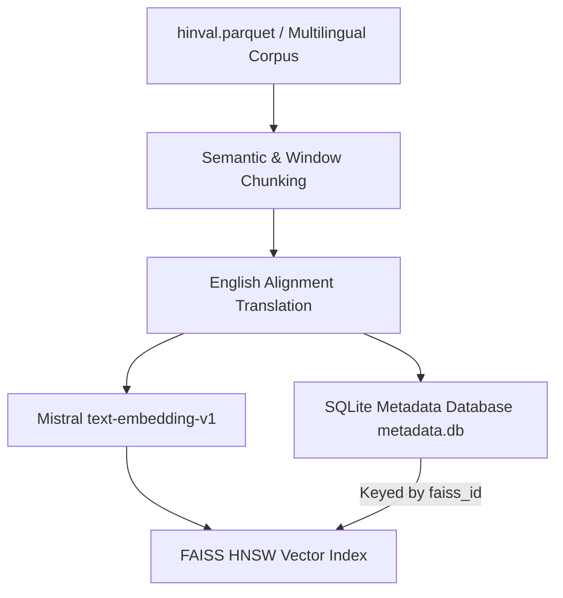
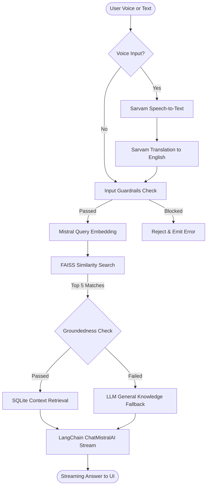

# 🚀 Multilingual RAG Search Engine with FAISS & SQLite

A production-grade, ultra-fast **Multilingual Retrieval-Augmented Generation (RAG)** search engine. This system combines **FAISS** (HNSW vector similarity index) and a local **SQLite** metadata database to execute sub-millisecond document retrievals, integrated with **Sarvam AI** (for voice transcription and query translation) and **Mistral AI** (for query embeddings and streaming LLM generation via **LangChain**).

---

## 🏗️ System Architecture Flow

The system runs in two main pipelines: **Indexing** (offline compilation) and **Retrieval & Answer Generation** (online runtime). 

> [!NOTE]
> You can open the architecture schematic file [`rag-pipeline-architecture.excalidraw`](./rag-pipeline-architecture.excalidraw) directly on [Excalidraw](https://excalidraw.com) to view the visual layout of these blocks.

### 1. Offline Indexing Pipeline


### 2. Online Retrieval & Generation Pipeline


---

## ⚡ Latency Sweep Benchmarks (97,941 Queries)
An offline sweep benchmark was executed against the full **97,941 query** Hindi dataset (`hinval.parquet`) using native pre-allocated float arrays:

| Metric | Latency (ms) | Target Budget (ms) | Status |
| :--- | :--- | :--- | :--- |
| **P50 Latency** | **0.8308 ms** | 200.0 ms | ✅ PASSED |
| **P70 Latency** | **0.8789 ms** | 200.0 ms | ✅ PASSED |
| **P100 Latency** | **69.6232 ms** | 200.0 ms | ✅ PASSED |

---

## ✨ Features

* **⚡ Sub-Millisecond Search**: Hybrid retrieval using FAISS native HNSW index search combined with SQLite indexed metadata lookups.
* **🗣️ Voice & Text Interface**: Real-time voice query recording, transcribing, and translating automatically.
* **🔒 Strict Safety Guardrails**: Built-in input filters to block jailbreaks/exploits, and output grounding checkers to catch hallucinations.
* **🔥 Dynamic Warmup Cache**: Server boots by executing 70 random diverse query searches to warm up V8 memory, index mappings, and SQLite disk caches.
* **🌊 Real-time SSE Execution Console**: The frontend features a live execution console that displays every pipeline step, its latency, and the exact system prompt.
* **🦜 LangChain Integration**: Powered by `@langchain/mistralai`'s `ChatMistralAI` model for production-ready model streaming.

---

## 🛠️ Local Development Setup

### Prerequisites
* **Node.js**: `v24+`
* C++ Build tools (`make`, `g++`) installed on your host system if building server node modules from scratch.

### 1. Configure Server Environment
Create a `server/.env` file with your credentials:
```ini
NODE_ENV=development
PORT=5000
MISTRAL_API_KEY=your_mistral_api_key
SARVAM_API_KEY=your_sarvam_api_key
```
> [!TIP]
> You can also supply rotated backup keys in the format `MISTRAL_API_KEY2`, `MISTRAL_API_KEY3`, etc. The server will cycle through them in a round-robin rotation.

### 2. Start the Backend Server
```bash
cd server
npm install
npm run build
npm start
```
On boot, the server will log:
`[INFO] Eagerly warming up FAISS searcher and SQLite database caches...`
`[INFO] RAG searcher warmup completed successfully with 70 diverse queries.`

### 3. Start the Frontend Client
```bash
cd Client
npm install
npm run dev
```
Open [http://localhost:5173](http://localhost:5173) in your browser.

---

## 🐳 Docker & Render Deployment

The repository includes a production-grade multi-stage **[`Dockerfile`](./Dockerfile)** optimized for deploying to cloud providers like Render.

### How to deploy to Render:
1. Create a new **Web Service** on Render and connect your repository.
2. Render will automatically detect the root `Dockerfile` and select the **Docker** runtime.
3. In the **Environment Variables** settings, configure:
   * `MISTRAL_API_KEY` = `your_mistral_key`
   * `SARVAM_API_KEY` = `your_sarvam_key`
   * `NODE_ENV` = `production`
4. Click **Deploy**. The container will compile all assets, copy the committed FAISS indices, warm up the database page pools, and run stably.

---

## 📁 Repository Structure
```
├── Client/                     # React Frontend App
│   ├── src/
│   │   ├── components/         # Orb visual, Source Cards, & Timeline Console
│   │   └── hooks/              # Audio recorder and RAG stream hooks
│   └── package.json
├── server/                     # Express Backend Server
│   ├── src/
│   │   ├── shared/
│   │   │   ├── controllers/    # RAG pipeline controller & warmups
│   │   │   └── utils/          # FAISS searches & LangChain connections
│   │   └── server.ts
│   └── package.json
├── indexing/                   # Index Generation Workspace
│   └── indexes/                # Committed FAISS index & SQLite DB files
└── Dockerfile                  # Production Multi-Stage Builder
```

---

## 📜 License
This project is proprietary. Developed for the HHGoa RAG search project.
