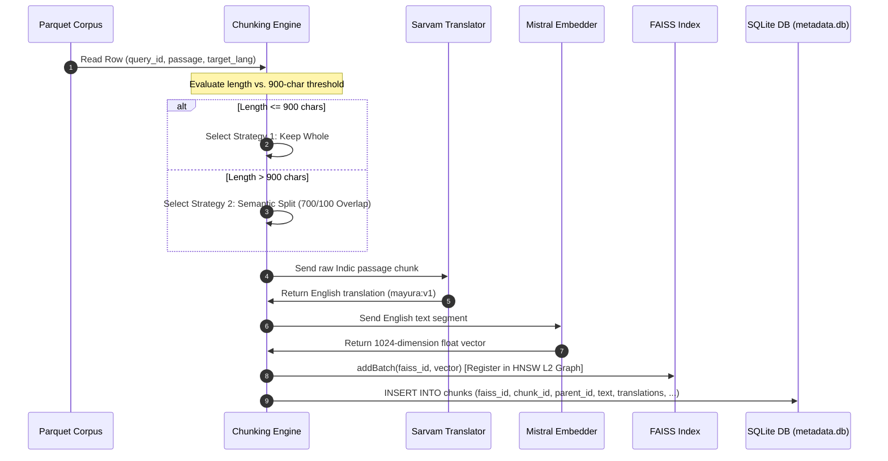
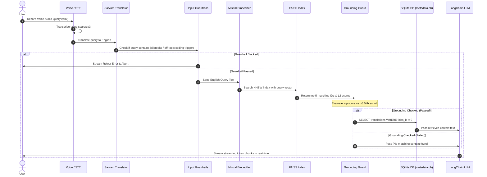

# 🚀 Multilingual RAG Search Engine with FAISS & SQLite

A production-grade, ultra-fast **Multilingual Retrieval-Augmented Generation (RAG)** search engine. This system combines **FAISS** (HNSW vector similarity index) and a local **SQLite** metadata database to execute sub-millisecond document retrievals, integrated with **Sarvam AI** (for voice transcription and query translation) and **Mistral AI** (for query embeddings and streaming LLM generation via **LangChain**).

---

## 🏗️ System Architecture Flow

The system runs in two main pipelines: **Indexing** (offline compilation) and **Retrieval & Answer Generation** (online runtime). 

---

### 1. Offline Indexing Pipeline

The indexing pipeline takes a multilingual document corpus (source Parquet file) and compiles it into a dual-layered search engine index consisting of a FAISS vector index and a local SQLite metadata database.

#### 📊 Indexing Execution Flow


#### 📝 Step-by-Step Indexing Trace Example

##### Input Row
We start with a raw Hindi fact row from `hinval.parquet`:
* **`query_id`**: `42`
* **`passage_index`**: `3`
* **`target_lang`**: `"hi"`
* **`passage`**: `"भारत की राजधानी नई दिल्ली है। यह एक ऐतिहासिक शहर है जिसमें लाल किला और इंडिया गेट जैसे प्रसिद्ध स्मारक हैं।"`

##### Step 1: Chunking Selection (Strategy 1 - Whole)
* **Action**: The length of the passage is 95 characters.
* **Evaluation**: $95 \le 900$ (below the `SHORT_PASSAGE_CHARS` threshold).
* **Output**: The entire passage is kept as a single chunk.
  * `chunk_id`: `"42-p3-c0"`
  * `parent_id`: `"42-p3"`
  * `chunk_type`: `"whole"`

##### Step 2: English Translation Alignment
* **Action**: The chunk is sent to the Sarvam Translation API using the `mayura:v1` model.
  * `source_language_code`: `"hi"`
  * `target_language_code`: `"en-IN"`
* **Output**: The API returns the English aligned translation:
  * `translated_text`: `"New Delhi is the capital of India. It is a historical city with famous monuments like the Red Fort and India Gate."`

##### Step 3: Vector Embedding Generation
* **Action**: The English text is sent to the Mistral Embeddings API (`mistral-embed`).
* **Output**: The API returns a `Float32Array` of size 1024:
  * `vector`: `[0.0124, -0.0452, 0.0891, ..., 0.0031]`

##### Step 4: FAISS Registration
* **Action**: The vector is appended to the FAISS index with a unique sequential ID.
  * `faiss_id`: `1042` (monotonic counter)
* **Output**: The vector is inserted into the HNSW graph L2 space under ID `1042`.

##### Step 5: SQLite Database Injection
* **Action**: The metadata database stores the raw text and its translations.
* **SQL Query**:
  ```sql
  INSERT INTO chunks (faiss_id, chunk_id, parent_id, text, query_id, passage_index, chunk_index, chunk_type, translations)
  VALUES (
    1042, 
    '42-p3-c0', 
    '42-p3', 
    'New Delhi is the capital of India. It is a historical city with famous monuments like the Red Fort and India Gate.', 
    42, 
    3, 
    0, 
    'whole', 
    '{"hi": "भारत की राजधानी नई दिल्ली है। यह एक ऐतिहासिक शहर है जिसमें लाल किला और इंडिया गेट..."}'
  );
  ```
* **Result**: SQLite creates a B-Tree entry on the Primary Key `faiss_id`.

---

### 2. Online Retrieval & Generation Pipeline

The retrieval pipeline takes a user's question, aligns it to English, performs a vector search in FAISS, retrieves the correct multilingual translation from SQLite, and generates a streaming answer.

#### 🌐 Retrieval Execution Flow


#### 📝 Step-by-Step Retrieval Trace Example

##### Step 1: Speech-to-Text (STT)
* **Action**: User clicks the purple blob on the UI and speaks: *"भारत की राजधानी क्या है?"*
* **Transcription Output**: Sarvam's `saaras:v3` model transcribes the WAV audio buffer:
  * `transcript`: `"भारत की राजधानी क्या है?"`
  * `language_code`: `"hi-IN"`

##### Step 2: Query Translation Alignment
* **Action**: The transcribed Hindi text is sent to the Sarvam Translate API:
  * `input`: `"भारत की राजधानी क्या है?"`
  * `source_language_code`: `"hi"`
  * `target_language_code`: `"en-IN"`
* **Output**: The API returns:
  * `translated_text`: `"What is the capital of India?"`

##### Step 3: Input Guardrails Check
* **Action**: The query is scanned against the security and off-topic list.
  * Query: `"what is the capital of india?"`
  * Security Match: None.
  * Off-Topic Match: None.
* **Output**: Guardrails pass successfully.

##### Step 4: Query Embedding
* **Action**: The English query `"What is the capital of India?"` is embedded.
* **Output**: The Mistral Embeddings API returns a 1024-dimension query vector:
  * `queryVector`: `[0.0118, -0.0421, 0.0815, ..., 0.0029]`

##### Step 5: FAISS Similarity Search
* **Action**: The query vector is searched against the loaded HNSW L2 vector index (`activeFolder = "aligned_english"`).
* **Output**: FAISS finds the top matching vector IDs:
  * Match 1: `faiss_id = 1042`, `distance = 0.1423`

##### Step 6: Grounding Verification
* **Action**: The top match L2 score is evaluated against the `-5.0` confidence limit.
  * Score: `-0.1423` (where `0.0` is a perfect match).
  * Evaluation: $-0.1423 \ge -5.0$.
* **Output**: Grounding check passes (`hasContext = true`).

##### Step 7: SQLite DB Metadata Seek
* **Action**: The system queries SQLite using the matching `faiss_id` to retrieve translation segments.
* **SQL Query**:
  ```sql
  SELECT * FROM chunks WHERE faiss_id = 1042;
  ```
* **Output**: SQLite executes a B-Tree search and returns the metadata row. Since the user's source language is `"hi-IN"` (Hindi), the system parses the `translations` column JSON object (`translations.hi`) and retrieves the Hindi translation text:
  * `text`: `"भारत की राजधानी नई दिल्ली है। यह एक ऐतिहासिक शहर है जिसमें लाल किला और इंडिया गेट..."`

##### Step 8: Contextual LLM Streaming
* **Action**: The system formats the prompt for the Mistral model:
  ```
  Context:
  [Source 1]: भारत की राजधानी नई दिल्ली है। यह एक ऐतिहासिक शहर है जिसमें लाल किला और इंडिया गेट...

  User Language: hi-IN
  ```
* **Output**: The LangChain `ChatMistralAI` model receives the system instructions and streams the response tokens back to the UI in Hindi:
  * Chunks: `"भारत "` ➡️ `"की "` ➡️ `"राजधानी "` ➡️ `"नई "` ➡️ `"दिल्ली "` ➡️ `"है।"`

---

## ⚡ Latency Sweep Benchmarks (97,941 Queries)
An offline sweep benchmark was executed against the full **97,941 query** Hindi dataset (`hinval.parquet`) using native pre-allocated float arrays:

| Metric | Latency (ms) | Target Budget (ms) | Status |
| :--- | :--- | :--- | :--- |
| **P50 Latency** | **0.8308 ms** | 200.0 ms | ✅ PASSED |
| **P70 Latency** | **0.8789 ms** | 200.0 ms | ✅ PASSED |
| **P100 Latency** | **69.6232 ms** | 200.0 ms | ✅ PASSED |

---

## ✨ Features

* **⚡ Sub-Millisecond Search**: Hybrid retrieval using FAISS native HNSW index search combined with SQLite indexed metadata lookups.
* **🗣️ Voice & Text Interface**: Real-time voice query recording, transcribing, and translating automatically.
* **🔒 Strict Safety Guardrails**: Built-in input filters to block jailbreaks/exploits, and output grounding checkers to catch hallucinations.
* **🔥 Dynamic Warmup Cache**: Server boots by executing 70 random diverse query searches to warm up V8 memory, index mappings, and SQLite disk caches.
* **🌊 Real-time SSE Execution Console**: The frontend features a live execution console that displays every pipeline step, its latency, and the exact system prompt.
* **🦜 LangChain Integration**: Powered by `@langchain/mistralai`'s `ChatMistralAI` model for production-ready model streaming.

---

## 🛠️ Local Development Setup

### Prerequisites
* **Node.js**: `v24+`
* C++ Build tools (`make`, `g++`) installed on your host system if building server node modules from scratch.

### 1. Configure Server Environment
Create a `server/.env` file with your credentials:
```ini
NODE_ENV=development
PORT=5000
MISTRAL_API_KEY=your_mistral_api_key
SARVAM_API_KEY=your_sarvam_api_key
```
> [!TIP]
> You can also supply rotated backup keys in the format `MISTRAL_API_KEY2`, `MISTRAL_API_KEY3`, etc. The server will cycle through them in a round-robin rotation.

### 2. Start the Backend Server
```bash
cd server
npm install
npm run build
npm start
```
On boot, the server will log:
`[INFO] Eagerly warming up FAISS searcher and SQLite database caches...`
`[INFO] RAG searcher warmup completed successfully with 70 diverse queries.`

### 3. Start the Frontend Client
```bash
cd Client
npm install
npm run dev
```
Open [http://localhost:5173](http://localhost:5173) in your browser.

---

## 🐳 Docker & Render Deployment

The repository includes a production-grade multi-stage **[`Dockerfile`](./Dockerfile)** optimized for deploying to cloud providers like Render.

### How to deploy to Render:
1. Create a new **Web Service** on Render and connect your repository.
2. Render will automatically detect the root `Dockerfile` and select the **Docker** runtime.
3. In the **Environment Variables** settings, configure:
   * `MISTRAL_API_KEY` = `your_mistral_key`
   * `SARVAM_API_KEY` = `your_sarvam_key`
   * `NODE_ENV` = `production`
4. Click **Deploy**. The container will compile all assets, copy the committed FAISS indices, warm up the database page pools, and run stably.

---

## 📁 Repository Structure
```
├── Client/                     # React Frontend App
│   ├── src/
│   │   ├── components/         # Orb visual, Source Cards, & Timeline Console
│   │   └── hooks/              # Audio recorder and RAG stream hooks
│   └── package.json
├── server/                     # Express Backend Server
│   ├── src/
│   │   ├── shared/
│   │   │   ├── controllers/    # RAG pipeline controller & warmups
│   │   │   └── utils/          # FAISS searches & LangChain connections
│   │   └── server.ts
│   └── package.json
├── indexing/                   # Index Generation Workspace
│   └── indexes/                # Committed FAISS index & SQLite DB files
└── Dockerfile                  # Production Multi-Stage Builder
```

---

## 📜 License
This project is proprietary. Developed for the HHGoa RAG search project.
