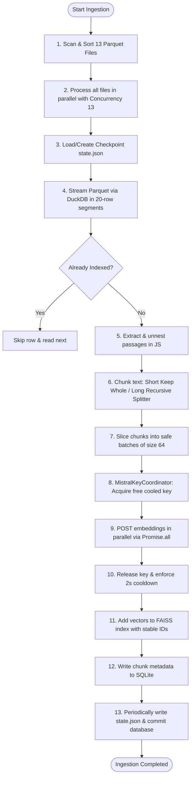

# Aligned Multilingual Ingestion & Search Indexing Pipeline

This guide explains how to set up, run, and commit the aligned English-only indexing pipeline with 10-shard parallel workers and local translation injection.

---

## 🚀 Quick Start Guide (For Non-Technical Users)

Follow these exact steps to run the pipeline and upload the finished index to GitHub.

### Step 1: Install Git LFS (Large File Storage)
Since the generated index files are too large for standard Git, we use Git LFS to upload them. Run this command once in your terminal:
```bash
git lfs install
```

Track index and database files with LFS:
```bash
git lfs track "*.faiss"
git lfs track "*.db"
```

---

### Step 2: Configure the Environment (`.env`)
Create a file named `.env` in the `indexing/` directory (or edit the existing one) and paste the following configuration.

Replace `/your/custom/input/folder/path` and `/your/custom/output/folder/path` with the actual folder paths on your VM:

```env
# 1. Folder Paths
TRAIN_DIR=/data/hfData/train     # The directory where the parquet files are stored
INDEX_ROOT=./indexes             # MANDATORY: Must be set to ./indexes to commit the index to Git!

# 2. Embedding Model (For 1024d Mistral API)
EMBEDDING_DIMENSION=1024
EMBEDDING_MODEL=mistral-embed

# 3. Mistral API keys (Provide your 50 keys here)
MISTRAL_API_KEY1=your_first_mistral_api_key_here
MISTRAL_API_KEY2=your_second_mistral_api_key_here
# ... add keys up to MISTRAL_API_KEY50
```

*Note: If you ever want to run a completely local CPU-only model without API keys, you can set `EMBEDDING_DIMENSION=384`, `EMBEDDING_MODEL=Xenova/bge-small-en-v1.5`, and `EMBEDDING_PROVIDER=local`.*

---

### Step 3: Run the Ingestion Workers (Shards 0-9)
We split the embedding task into 10 parallel segments (shards) containing 3,000 rows each (total 30,000 rows).

You can run them in separate terminals (recommended for safety so you can watch for crashes/errors) or launch them all at once in the background.

#### Option A: Separate Terminals (Safer, Recommended)
Open 10 terminal windows/tabs and run:
* **Terminal 0**: `npx tsx aligned-index.ts shard 0`
* **Terminal 1**: `npx tsx aligned-index.ts shard 1`
* **Terminal 2**: `npx tsx aligned-index.ts shard 2`
* **Terminal 3**: `npx tsx aligned-index.ts shard 3`
* **Terminal 4**: `npx tsx aligned-index.ts shard 4`
* **Terminal 5**: `npx tsx aligned-index.ts shard 5`
* **Terminal 6**: `npx tsx aligned-index.ts shard 6`
* **Terminal 7**: `npx tsx aligned-index.ts shard 7`
* **Terminal 8**: `npx tsx aligned-index.ts shard 8`
* **Terminal 9**: `npx tsx aligned-index.ts shard 9`

#### Option B: Single Background Command (Quickest)
Run this single command to start all 10 workers in the background (logs will be saved to `shard_0.log`, `shard_1.log`, etc.):
```bash
for i in {0..9}; do npx tsx aligned-index.ts shard $i > shard_$i.log 2>&1 & done
```
*(To stop all background workers at any time, run: `pkill -f aligned-index.ts`)*

#### 📊 How to check progress:
You can check completion percentages at any time by running:
```bash
npx tsx aligned-index.ts status
```

---

### Step 4: Merge the Shards
Once all 10 shards show `✅ Completed` in the status log, combine them into a single index file:
```bash
npx tsx aligned-index.ts merge
```

---

### Step 5: Inject Translation Metadata
This step reads all 13 translation languages and syncs them into the database. It runs completely locally on your CPU and takes under 1 minute:
```bash
npx tsx aligned-index.ts inject
```

---

### Step 6: Commit and Push to GitHub
Now that the index files are built inside `indexes/aligned_english`, commit them using LFS and push to Git:

```bash
git add .gitattributes indexes/aligned_english/
git commit -m "Build and upload aligned 30k English-only index"
git push
```

---

## How the indexing pipeline works

The flow is implemented across these files:

- Parquet stream read: `get-data.ts`
- Chunking: `chunk-data.ts`
- Embedding: `embedder.ts`
- Vector index: `faiss-index.ts`
- Metadata store: `metadata-store.ts`
- Orchestration: `index-pipeline.ts`
- Paths/config: `config.ts`
- Resume/checkpoint: `checkpoint.ts`

### Ingestion & Ingesting Pipeline Flowchart



### 1) It reads the Hugging Face dataset as parquet files

The code scans a directory for `.parquet` files, one per language, and streams rows from DuckDB instead of loading the whole file into memory. That logic is in `get-data.ts`.

Each row is decoded into a `PassageRow` with:

- `query_id`
- `target_lang`
- `passage_index`
- `passage`
- `is_selected`

### 2) It chunks each passage

In `chunk-data.ts`, each passage goes through `chunkPassage()`.

There are two chunking behaviors:

- Short passage: if `passage.length <= 900`, it keeps the whole passage as one chunk.
- Long passage: it uses `RecursiveCharacterTextSplitter` from LangChain.

The splitter uses:

- `chunkSize = 700`
- `chunkOverlap = 100`
- separators in this priority order:
    - blank lines
    - newlines
    - Hindi sentence enders (`। `, `॥ `)
    - English punctuation (`. `, `? `, `! `)
    - spaces
    - characters

So this is not a “semantic chunker” in the LLM-sense; it is a hierarchical recursive character splitter that tries to break text at meaningful boundaries before falling back to raw character splits.

The code labels chunks as:

- `whole` for short passages
- `semantic` for recursive split passages

> The name `semantic` is a bit misleading; it is really a recursive text split, not a semantic clustering step.

### 3) It embeds each chunk

Each chunk text is sent to an embedder from `embedder.ts`.

Supported options:

- `local` using `@xenova/transformers`
- `http` sending requests to an embedding service
- `Mistral` embedder also exists in the file

The embedding output is a flat `Float32Array` shaped as:

- `N * dimension`

This is important because FAISS expects that flat row-major layout directly.

### 4) It adds vectors to FAISS with explicit IDs

This is the key part.

In `faiss-index.ts`, the code does:

- builds a FAISS index via `IndexIDMap2`
- each vector gets a stable custom ID
- IDs are assigned from a monotonic checkpoint counter, not FAISS’s implicit insertion order

The code comment is explicit: they want a stable external ID so resume behavior and metadata lookups survive index rebuilds.

The index is created as:

- `HNSW32,Flat` by default (approximate, production path)
- or `IndexFlatL2` if `INDEX_TYPE` is set to `flat`

The actual vector insert is:

- `this.index.addWithIds(Array.from(vectors), ids);`

So the vectors are stored in a FAISS index object, not in a separate “vector table”.

---

## How the embeddings are stored in the vector DB

The short answer is:

- The vector DB is FAISS
- The actual file name is `index.faiss`
- It is stored under a per-language directory
- The metadata is kept separately in SQLite

From `config.ts`, the default root is:

- `INDEX_ROOT = /data/hhgoa/indexes`

Then for each language, the script writes:

- `/data/hhgoa/indexes/<language>/index.faiss`
- `/data/hhgoa/indexes/<language>/metadata.db`
- `/data/hhgoa/indexes/<language>/state.json`

And the orchestration in `index-pipeline.ts` does:

- `const dir = path.join(INDEX_ROOT, language);`
- `const indexFile = path.join(dir, "index.faiss");`

So the actual vector index filename is exactly:

- `index.faiss`

The SQLite metadata table is called:

- `chunks`

with a column:

- `faiss_id INTEGER PRIMARY KEY`

This `faiss_id` is the same ID used in the FAISS index. So the mapping looks like this:

- FAISS vector label = `faiss_id`
- SQLite row = same `faiss_id`
- chunk text and metadata are looked up by that `faiss_id`

This is why `metadata-store.ts` has a table schema like:

- `faiss_id`
- `chunk_id`
- `parent_id`
- `text`
- `query_id`
- `language`
- `passage_index`
- `is_selected`
- `chunk_index`
- `chunk_type`

and `addBatch()` writes rows with:

- `faiss_id: Number(faissIds[i])`

So the vector DB is not storing text in FAISS itself. FAISS stores numeric vectors + their IDs; the text/metadata is stored in SQLite for retrieval and display.

---

## General end-to-end flow

1. Read parquet rows from source dataset
2. Convert each text passage to one or more chunks
3. Embed each chunk with the chosen embedding model
4. Assign a stable `faiss_id` per chunk
5. Add vector + ID into FAISS
6. Save the same chunk metadata into SQLite via `faiss_id`
7. Periodically checkpoint:
    - save the FAISS index
    - checkpoint SQLite WAL
    - save `state.json`
